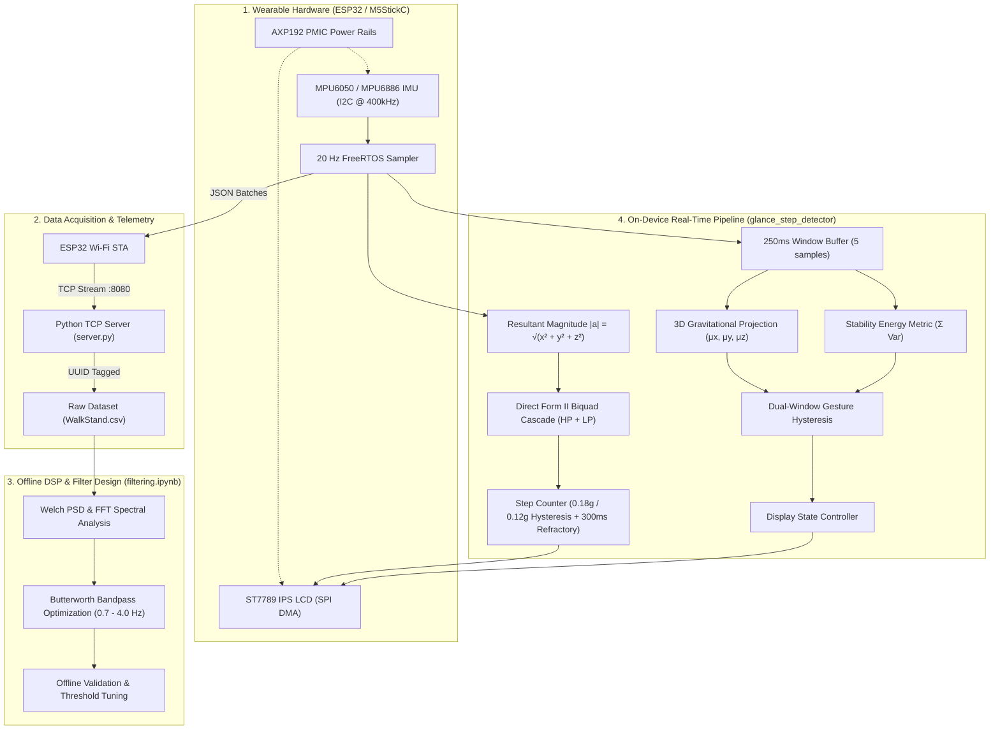

# Wearable IMU Pipeline

[](https://docs.espressif.com/projects/esp-idf/)
[](https://en.cppreference.com/)
[](https://www.python.org/)
[](https://www.freertos.org/)
[](https://scipy.org/)
[](https://opensource.org/licenses/MIT)

An end-to-end embedded systems and digital signal processing (DSP) pipeline for wrist-worn wearable devices. The project encompasses hardware sensor drivers, low-latency telemetry streaming over Wi-Fi, offline spectral analysis and filter tuning in Python, and on-device real-time step counting with glance-activated gesture visualization on an integrated IPS display.

---

## System Architecture



---

## Projects Overview

The repository is structured into three self-contained modules:

```text
wearable-imu-pipeline/
├── data_acquisition/          # Embedded Wi-Fi sensor streaming & host ingestion
│   ├── main/                  # ESP-IDF firmware (I2C driver, Wi-Fi, FreeRTOS tasks)
│   └── server/                # Multi-threaded Python TCP receiver & CSV writer
├── glance_step_detector/      # Standalone real-time on-device DSP & gesture firmware
│   └── main/                  # Biquad filter cascade, glance classifier, LCD SPI driver
└── filtering/                 # Offline signal processing & exploratory data analysis
    ├── filtering.ipynb        # Jupyter notebook with Welch PSD, FFT, and filter design
    ├── WalkStand.csv          # Benchmark dataset of continuous walking and standing
    └── requirements.txt       # Python DSP dependencies (NumPy, SciPy, Matplotlib)
```

---

## Key Technical Highlights

### 1. Real-Time On-Device Digital Signal Processing
- **Orientation Invariance**: Calculates the 3D Euclidean magnitude $\|a\| = \sqrt{x^2 + y^2 + z^2}$ to decouple step detection from wrist rotation.
- **Cascaded IIR Biquad Filters**: Implemented using Direct Form II Transposed topology:
  - **2nd-Order High-Pass Filter ($f_c = 0.7\text{ Hz}$)**: Strips static gravity offset ($1.0g$) and slow posture drift.
  - **2nd-Order Low-Pass Filter ($f_c = 4.0\text{ Hz}$)**: Suppresses sensor jitter and high-frequency arm swing harmonics.
- **Step Peak Detector**: Uses an envelope thresholding scheme ($0.18g$ enter, $0.12g$ exit) paired with a $300\text{ ms}$ refractory blanking interval to prevent double-counting.

### 2. Glance Posture & Gesture Estimation
- **3D Gravitational Vector Projection**: Monitors orientation angles over $250\text{ ms}$ windows ($5$ samples at $20\text{ Hz}$):
  - $\mu_z > 0.70g$: Screen tilted upward facing the user.
  - $\mu_x > 0.18g$: Forearm angle tilted toward the torso.
  - $|\mu_y| < 0.45g$: Strict roll bounds preventing accidental side-view triggers.
- **Variance Stability Metric**: Evaluates posture steadiness using summed axis variance $E_{\text{stab}} = \text{Var}(X) + \text{Var}(Y) + \text{Var}(Z) < 0.035$ to ignore violent arm swings.
- **Dual-Window Temporal Hysteresis**: Requires two consecutive valid windows to enter/exit glance mode, eliminating display flicker at orientation boundaries.

### 3. Embedded Engineering & Power Efficiency
- **FreeRTOS Integration**: Periodic execution via `vTaskDelayUntil` ensuring deterministic $20\text{ Hz}$ ($50\text{ ms}$) sampling.
- **AXP192 PMIC Power Management**: Configures LDO power rails on startup for internal sensor and display power domains.
- **SPI DMA Display Driver**: ST7789 135×240 IPS display driven with synchronous DMA transfers, double-buffered scanline fills, and a custom integer-scaled 5×7 bitmap font renderer.

---

## Hardware Specifications & Pinout

| Component | Specification | GPIO Mapping (ESP32) |
| :--- | :--- | :--- |
| **Microcontroller** | ESP32-PICO-D4 (240 MHz Dual Core, 520 KB SRAM) | Integrated |
| **IMU** | MPU6050 / MPU6886 (6-Axis Accel/Gyro) | **SDA**: GPIO 21, **SCL**: GPIO 22 |
| **Display** | ST7789 1.14" IPS LCD (135 × 240 pixels) | **CLK**: 13, **MOSI**: 15, **CS**: 5, **DC**: 23, **RST**: 18 |
| **PMIC** | AXP192 Power Management IC | I2C Address `0x34` |
| **User Input** | Active-Low Button (Button A) | **GPIO 39** (External Pull-Up) |

---

## Quickstart Guide

### Prerequisites
- **ESP-IDF** (v5.0 or later installed and exported to PATH)
- **Python 3.10+** (with virtual environment support)

### 1. Data Collection & Streaming Pipeline

```bash
# 1. Start the host-side TCP ingestion server
cd data_acquisition/server
python3 server.py --host 0.0.0.0 --port 8080 --output-dir data

# 2. Configure Wi-Fi credentials in a new terminal
cd data_acquisition/main
cp secrets.example.h secrets.h
# Edit secrets.h with your Wi-Fi SSID and password

# 3. Flash the acquisition firmware to the wearable
cd data_acquisition
idf.py set-target esp32
idf.py build
idf.py -p /dev/ttyUSB0 flash monitor
```
*Press Button A (GPIO 39) on the wearable to start/stop recording. Saved datasets will appear in `data_acquisition/server/data/<uuid>.csv`.*

### 2. Offline DSP Analysis & Notebook

```bash
cd filtering
python3 -m venv .venv
source .venv/bin/activate
pip install -r requirements.txt

# Launch Jupyter Notebook
jupyter notebook filtering.ipynb
```

### 3. Deploy On-Device Glance & Step Detector Firmware

```bash
cd glance_step_detector
idf.py set-target esp32
idf.py build
idf.py -p /dev/ttyUSB0 flash monitor
```
*When worn on the wrist, walking increments the internal step counter. Raising the wrist into a reading posture triggers the glance detector and illuminates the LCD with the live step count.*

---

## Academic Context

This project was originally developed as an advanced engineering assignment in wearable computing and embedded human-computer interaction (HCI), focusing on sensor fusion, embedded digital filtering, and natural gesture interfaces. It has been refined into a modular, production-ready open-source pipeline.

---

## License

This project is licensed under the [MIT License](LICENSE) - see the [LICENSE](LICENSE) file for details.
