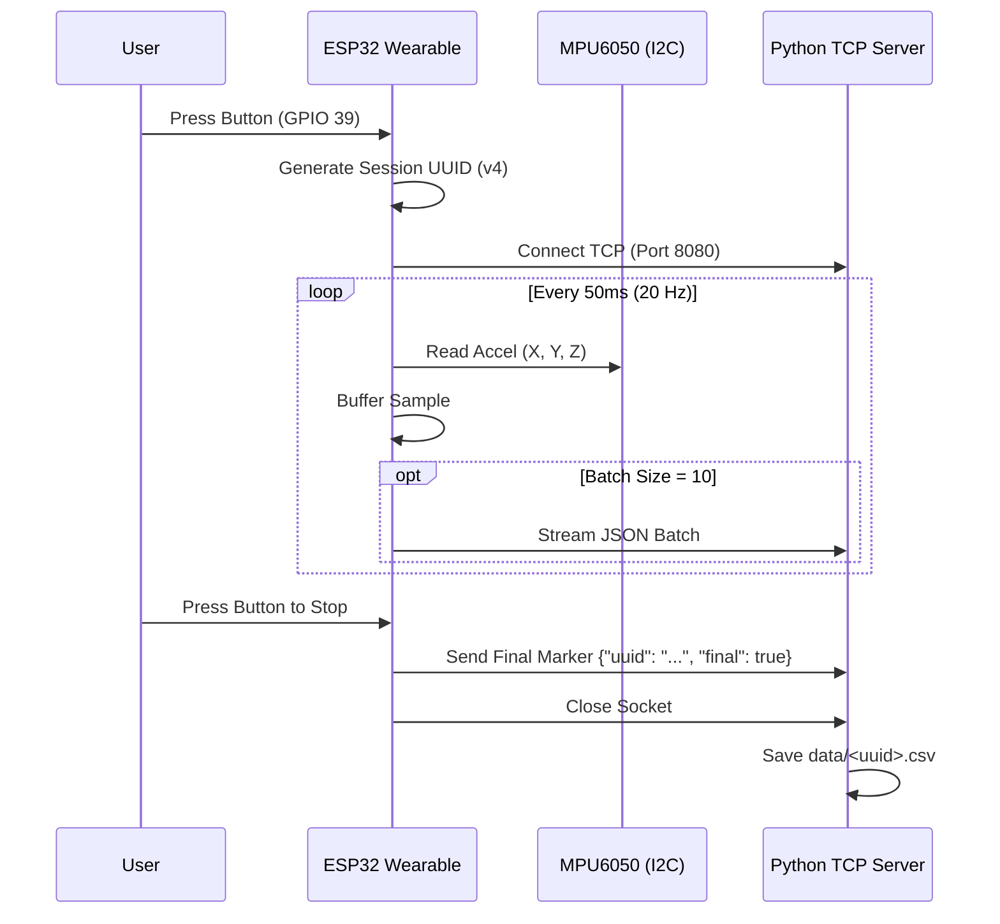

# Wearable IMU Data Acquisition & Streaming

This subproject provides the real-time sensor recording and Wi-Fi streaming pipeline. It captures raw 3-axis accelerometer data on the ESP32 wearable at 20 Hz, batches readings, and streams newline-delimited JSON payloads over TCP to a host ingestion server, which persists each recording session as a timestamped/UUID-tagged CSV file for offline DSP analysis.

---

## Features

- **MPU6050 IMU Driver**: Hardware I2C communication (400 kHz) converting raw 16-bit register values to normalized gravitational acceleration ($g$).
- **Wi-Fi Station Mode**: Automatic network connection and background reconnect timers using ESP-IDF event groups.
- **Hardware-Controlled Recording**: Active-low button control on GPIO 39 with software debounce to start and stop sessions.
- **Session Tracking**: Automatic generation of RFC 4122 v4 UUIDs for every recording session.
- **Batch Streaming**: Batches 10 samples per TCP packet to reduce network socket overhead and power consumption.
- **Multi-Client Python Host Receiver**: Multi-threaded TCP receiver (`server.py`) that buffers session packets and saves CSV files with header `x,y,z`.

---

## System Architecture



---

## Project Structure

```text
data_acquisition/
├── CMakeLists.txt              # ESP-IDF project CMake file
├── README.md                   # Subproject documentation
├── main/
│   ├── CMakeLists.txt          # Component registration & dependencies
│   ├── imu_driver.c            # MPU6050 I2C driver implementation
│   ├── imu_driver.h            # IMU driver interface & register definitions
│   ├── main.c                  # Wi-Fi, button handler & streaming loop
│   └── secrets.example.h       # Wi-Fi credentials template
└── server/
    ├── server.py               # TCP ingestion server & CSV exporter
    └── data/                   # Default output folder for recorded sessions
```

---

## Getting Started

### 1. Configure Wi-Fi Credentials

Copy the example secrets header to `secrets.h` and update with your network credentials:

```bash
cd data_acquisition/main
cp secrets.example.h secrets.h
```

In `data_acquisition/main/main.c`, set `SERVER_IP` to your host computer's local IP address:

```c
#define SERVER_IP      "192.168.1.100"  // Replace with your host machine IP
#define SERVER_PORT    8080
```

### 2. Start the Host TCP Receiver

From the `data_acquisition/server` directory:

```bash
python3 server.py --host 0.0.0.0 --port 8080 --output-dir data
```

### 3. Build and Flash Firmware

Connect your ESP32 device and run:

```bash
cd data_acquisition
idf.py set-target esp32
idf.py build
idf.py -p /dev/ttyUSB0 flash monitor
```

### 4. Record Sensor Data

1. Press the wearable device button (GPIO 39) once to start recording.
2. Perform physical activity (e.g., walking, standing, gesturing).
3. Press the button again to stop recording.
4. The server receives the completion marker and writes `server/data/<uuid>.csv`.
