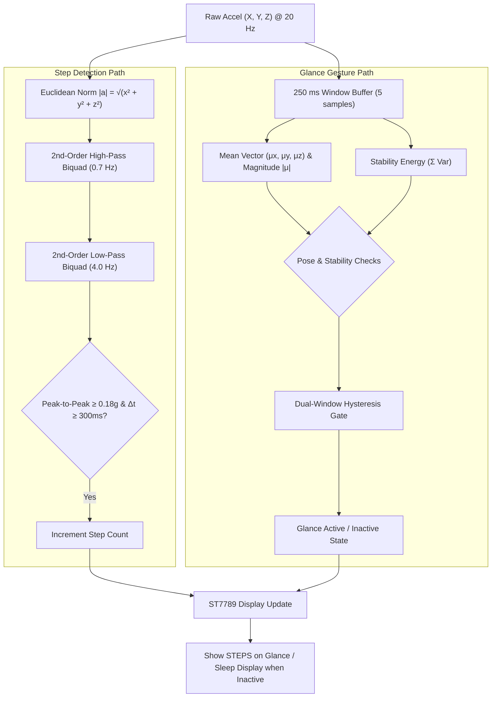

# On-Device Glance & Step Detection Firmware

This subproject implements real-time on-device digital signal processing (DSP) and posture estimation on the ESP32 wearable. It continuously tracks walking activity and estimates wrist-raise "glance" gestures to dynamically illuminate the step count on the integrated LCD panel.

---

## Technical Highlights

- **Fixed-Rate Processing (20 Hz)**: Precise FreeRTOS `vTaskDelayUntil` sampling loop.
- **Cascaded IIR Biquad Filtering**: 2nd-order high-pass (0.7 Hz) and low-pass (4.0 Hz) Direct Form II Transposed filters for isolating walking cadence from baseline gravity and high-frequency noise.
- **Hysteresis-Gated Step Counter**: Peak-to-peak amplitude gating with 0.18 g enter and 0.12 g exit thresholds, paired with a 300 ms refractory blanking period.
- **Glance Posture Classifier**: 3D gravity vector analysis with stability energy gating ($\sum \mathrm{Var}(X, Y, Z)$) and dual-window temporal hysteresis.
- **Hardware Graphics Driver**: ST7789 IPS LCD controller over SPI DMA with synchronized memory transfers and custom scalable bitmap font rendering.
- **Power Management**: Automatic AXP192 PMIC rail initialization for sensor and display subsystems.

---

## Signal Processing & State Machine



---

## Classifier Tuning Parameters

| Parameter | Value | Description |
| :--- | :--- | :--- |
| **Sampling Frequency** | `20 Hz` | IMU sampling and filter update rate |
| **Glance Window Size** | `5 samples (250 ms)` | Window length for posture and stability estimation |
| **Stability Energy Threshold (Enter / Exit)** | `0.035 / 0.055` | Maximum permissible variance to enter/remain in glance mode |
| **Mean Z Threshold (Enter / Exit)** | `> 0.70 g / < 0.60 g` | Screen facing upwards toward user |
| **Mean X Threshold (Enter / Exit)** | `> 0.18 g / < 0.06 g` | Wrist-tilt angle toward body |
| **Abs Mean Y Threshold (Enter / Exit)** | `< 0.45 g / > 0.60 g` | Roll angle constraint |
| **Glance Hysteresis Windows** | `2 enter / 2 exit` | Prevents threshold oscillation and screen flickering |
| **Step Filter Cutoffs** | `0.7 Hz HP / 4.0 Hz LP` | Bandpass cascade for gait frequencies |
| **Step Activity Thresholds** | `0.18 g enter / 0.12 g exit` | Dynamic envelope gating |
| **Step Refractory Interval** | `300 ms` | Minimum time spacing between consecutive steps |

---

## Display & Hardware Configuration

- **Target Board**: M5StickC / ESP32-PICO
- **LCD Controller**: ST7789 (135 × 240 IPS display)
- **Pinout (Default ESP32 SPI)**:
  - **SCLK**: GPIO 13
  - **MOSI**: GPIO 15
  - **CS**: GPIO 5
  - **DC**: GPIO 23
  - **RST**: GPIO 18
- **IMU**: MPU6050 / MPU6886 over I2C (SDA: GPIO 21, SCL: GPIO 22)

---

## Build & Flash

From the `glance_step_detector` directory:

```bash
idf.py set-target esp32
idf.py build
idf.py -p /dev/ttyUSB0 flash monitor
```